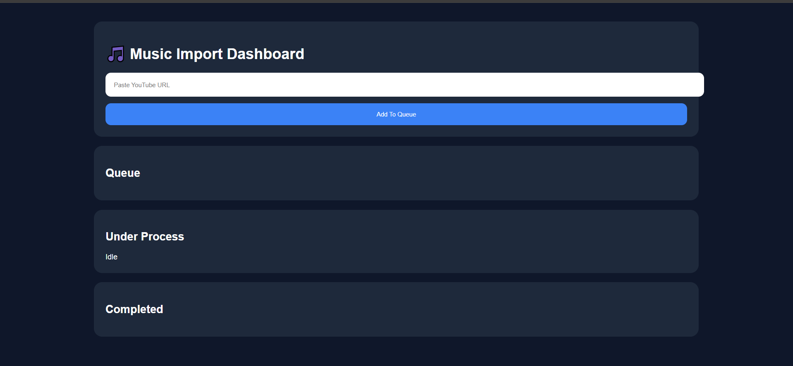
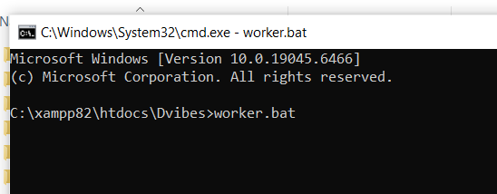
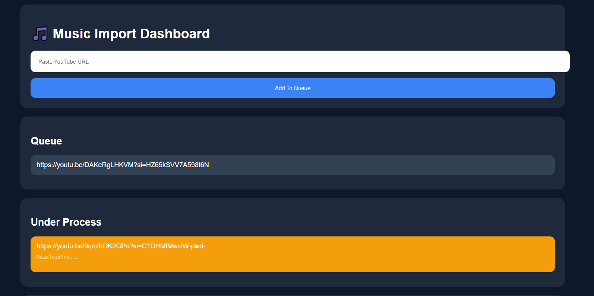
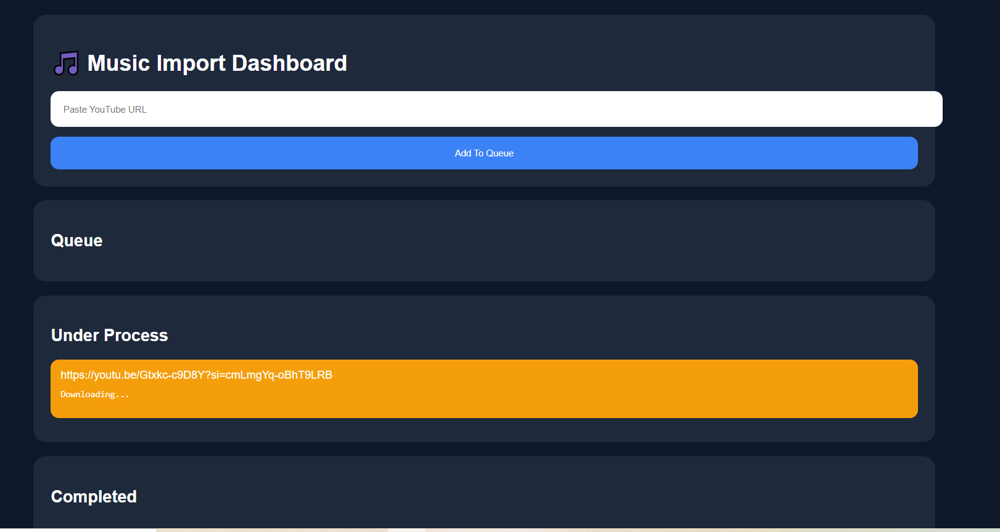
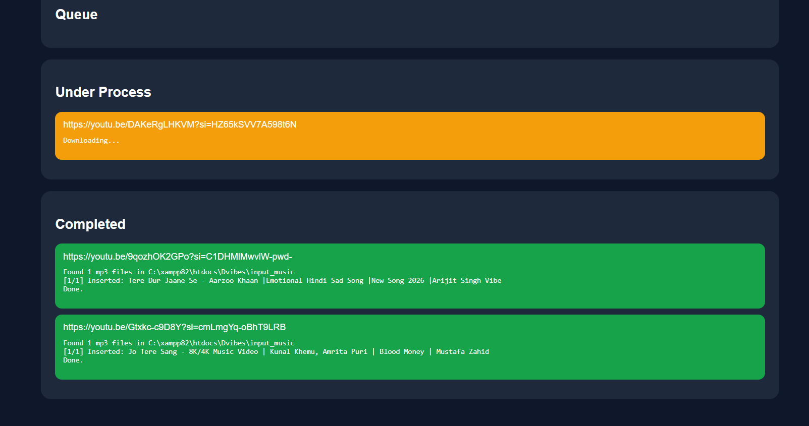

# 🎵 Music Import Dashboard

An automated music ingestion pipeline that downloads songs from YouTube and imports them directly into a music library with **zero manual intervention**.

Simply paste a YouTube video or playlist URL into the dashboard, and the system automatically downloads the audio, extracts metadata and artwork, organizes the files, and inserts everything into the database.

---

## ✨ Features

### 📥 YouTube Import

- Import single YouTube videos
- Import entire YouTube playlists
- Queue unlimited download requests
- Automatic sequential processing

### 🎵 Automatic Audio Processing

- Downloads audio in high-quality MP3 format
- Embeds metadata into MP3 files
- Preserves best available audio quality

### 🖼️ Automatic Thumbnail Extraction

- Extracts album artwork / thumbnail
- Stores thumbnails separately
- Generates browser-accessible image paths

### 📚 Metadata Extraction

Automatically extracts:

- Song Title
- Artist
- Album
- Duration
- Audio Hash

No manual data entry required.

### 💾 Library Management

Automatically:

- Stores MP3 files
- Stores thumbnails
- Organizes media folders
- Creates database records
- Prevents duplicate imports

### 📊 Live Dashboard

Monitor the entire import pipeline in real time.

Dashboard displays:

- Pending Queue
- Currently Processing
- Completed Jobs
- Failed Jobs
- Live processing logs

---

# 🚀 How It Works

```
User Pastes YouTube URL
          │
          ▼
Added to Download Queue
          │
          ▼
Background Worker
          │
          ▼
yt-dlp Downloads Audio
          │
          ▼
Python Extracts Metadata
          │
          ▼
Thumbnail Extraction
          │
          ▼
Store MP3 & Thumbnail
          │
          ▼
Insert Database Record
          │
          ▼
Ready to Stream
```

---

# 🛠️ Built With

- PHP
- Python
- MySQL
- yt-dlp
- FFmpeg
- HTML
- CSS
- JavaScript
- AJAX
- XAMPP

---

# 📂 Project Structure

```
App/
├── add_music.php
├── process_queue.php
├── worker.bat
├── queue.json
├── status.json
├── ingest_music_from_folder.py
├── input_music/
└── storage/
    ├── music/
    └── thumbnails/
```

---

# ⚡ Workflow

1. Paste a YouTube song or playlist URL.
2. The request is added to the processing queue.
3. Background worker continuously monitors the queue.
4. yt-dlp downloads the audio.
5. Python extracts metadata and artwork.
6. Files are moved to permanent storage.
7. Metadata is inserted into MySQL.
8. Dashboard updates the job status automatically.

---

# 📊 Dashboard Features

- Queue Management
- Live Processing Logs
- Download Progress
- Success & Failure Tracking
- Automatic Refresh
- Real-time Worker Status

---

# 🗂 Database Information

Each imported song automatically creates a database entry containing:

- Title
- Artist
- Album
- Duration
- Audio Hash
- MP3 File Path
- Thumbnail Path

---

# 📦 Requirements

- PHP 8+
- MySQL
- Python 3
- yt-dlp
- FFmpeg
- XAMPP

Python packages:

```bash
pip install mutagen mysql-connector-python pillow yt-dlp
```

---

# ▶️ Getting Started

Start Apache and MySQL using XAMPP.

Run the background worker:

```bash
worker.bat
```

Open the dashboard:

```
http://localhost/dashboard/App/add_music.php
```

Paste any YouTube video or playlist URL and click **Add To Queue**.

Everything else is handled automatically.

---

# 🔥 Highlights

- Queue-based processing
- Supports playlists
- High-quality MP3 downloads
- Automatic metadata extraction
- Automatic thumbnail extraction
- Automatic database insertion
- Real-time dashboard monitoring
- Fully automated ingestion pipeline

---

# 📸 Screenshots

Add screenshots of:

- Dashboard

- starting batch 

- Queue

- Processing Logs

- Completed Imports



---

# 🎯 Project Purpose

This project was built to automate the content ingestion process for a personal music streaming platform.

Instead of manually downloading songs, extracting metadata, creating thumbnails, organizing files, and inserting database records, the entire workflow is completed automatically from a single YouTube URL.

---

## 📄 License

This project is intended for educational and personal learning purposes.